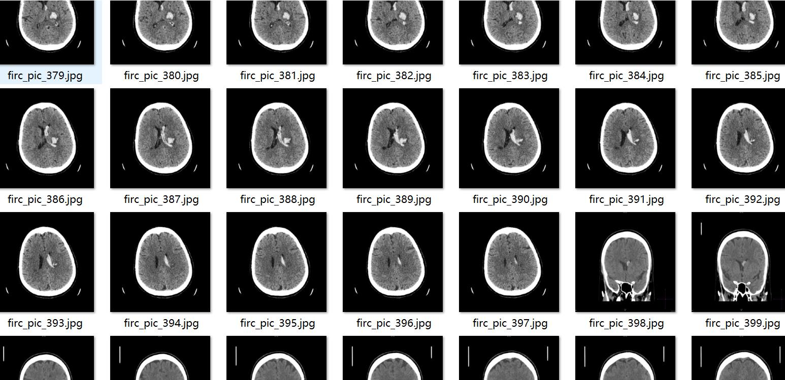
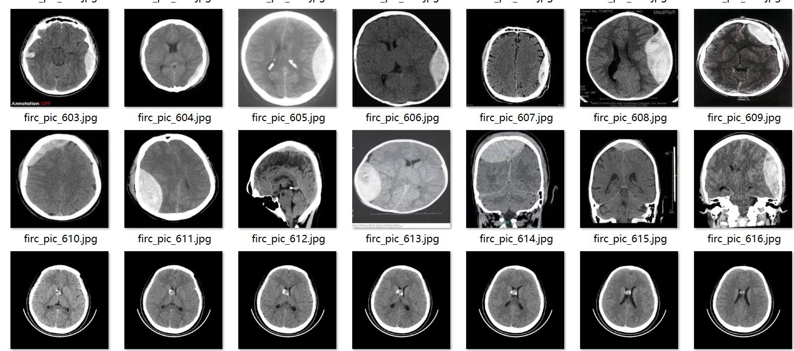
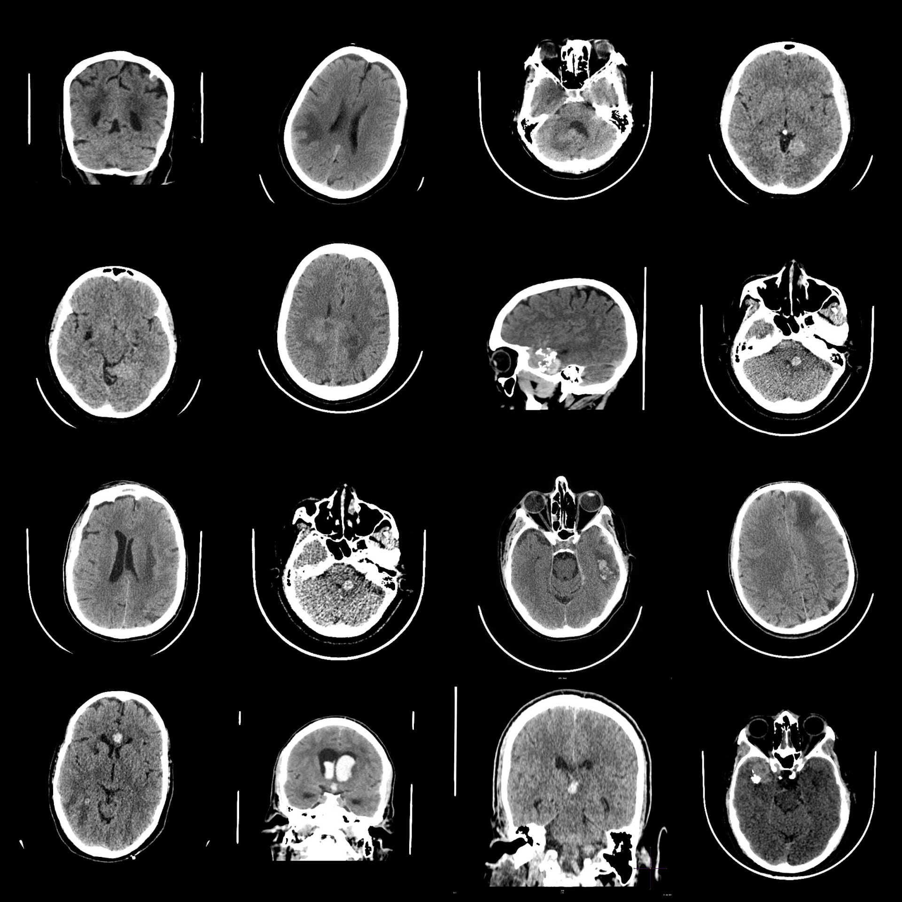
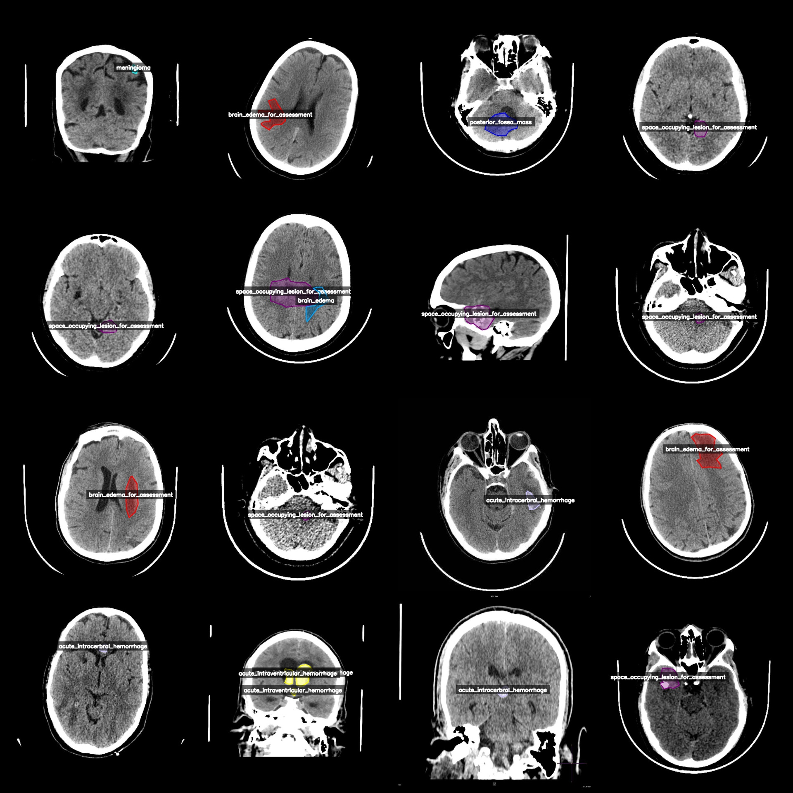
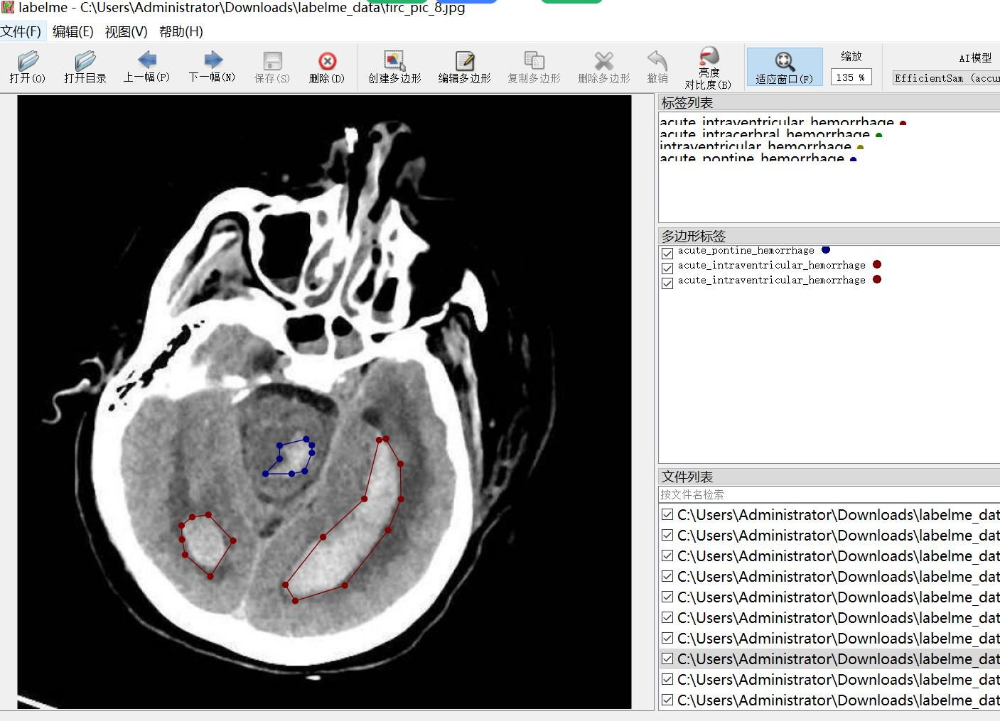

# Intelligent Medical Brain CT Disease Identification and Segmentation Dataset in LabelMe Format with 1521 Categories

Dataset format: labelme format (without mask file, only jpg images and corresponding json files)
Number of images (jpg files): 1521
Number of annotations (json files): 1521
Number of annotation categories: 31
Annotation category names: ["acute_brain_stem_hemorrhage", "acute_cerebellarhemorrhage", "acute_extradural_hematoma", "acute_hemorrhage", "acute_intracerbral_hemorrhage", "acute_intraventricular_hemorrhage", "acute_pontine_hemorrhage", "acute_subarachnoid_hemorrhage", "acute_subdural_hemorrhage", "acutesubarachnoid_hemorrhage", "avm", "brain_abscess", "brain_edema", "brain_edema_for_assessment", "brain_stem_hemorrhage", "chronic_subdural_hemorrhage", "craniopharyngioma", "cyst", "extraaxial_acute_hemorrhage", "extraaxial_hemorrhage", "fresh_blood", "intracerebral_hemorrhage", "intraventricular_hemorrhage", "meningioma", "pineal_mass", "posterior_fossa_mass", "space_occupying_lesion_for_assessment", "subacute_intraventricular_hemorrhage", "subacute_subdural_hemorrhage", "subarachnoid_hemorrhage", "subdural_hemorrhage"]
The number of boxes for each category:
- acute_brain_stem_hemorrhage (acute brain stem hemorrhage) count = 1
- acute_cerebellar_hemorrhage (acute cerebellar hemorrhage) count = 1
- acute_extradural_hematoma (acute extradural hematoma) count = 30
- acute_hemorrhage (acute hemorrhage) count = 5
- acute_intracerebral_hemorrhage (acute intracerebral hemorrhage) count = 274
- acute_intraventricular_hemorrhage (acute intraventricular hemorrhage) count = 390
- acute_pontine_hemorrhage (acute pontine hemorrhage) count = 94
- acute_subarachnoid_hemorrhage (acute subarachnoid hemorrhage) count = 56
- acute_subdural_hemorrhage (acute subdural hemorrhage) count = 22
Acute Subarachnoid Hemorrhage (Acute SAH) count = 4
AVM (Aneurysmal Vascular Malformation) count = 76
Brain Abscess (Brain Abcess) count = 9
Brain Edema (Brain Edema) count = 54
Brain Edema for Assessment (Brain Edema for Assessment) count = 79
Brain Stem Hemorrhage (Brain Stem Hemorrhage) count = 2
Chronic Subdural Hemorrhage (Chronic SDH) count = 4
Craniopharyngioma (Craniopharyngioma) count = 53
Cyst (Cyst) count = 143
Extraaxial Acute Hemorrhage (Extraaxial AH) count = 3
Extraaxial Hemorrhage (Extraaxial H) count = 21
Fresh Blood (Fresh Blood) count = 11
Intracranial Hemorrhage (Intracranial H) count = 14
Intraventricular Hemorrhage (IVH) count = 48
Meningioma (Meningioma) count = 228
The pineal mass count is 69.
posterior_fossa_mass count = 22
space_occupying_lesion_for_assessment count = 191
subacute_intraventricular_hemorrhage count = 18
subacute_subdural_hemorrhage count = 65
subarachnoid_hemorrhage count = 8
Subdural Hemorrhage (Hard Brain Surface Hemorrhage) Count = 2
Total frames: 1997
Utilize annotation tool: labelme=5.5.0
Image resolution: 640x640
Annotation rule: Draw a polygon box around the class.
important notes: You can open and edit the dataset with labelme. For json datasets, you need to convert them into mask or yolo format or coco format for semantic segmentation or instance segmentation.
Special Statement: This dataset does not guarantee the accuracy of the trained models or weight files.
Image preview:
## Images

Here is a pay link on Stripe ( https://buy.stripe.com/3cs8yP7sY87d0vu9AB ). Please contact me lonlonago@foxmail.com after funding $89, and I will send you a complete data files , thank you!

